# Cloud Factory Demo

This repository is the canonical source for a simple cloud factory: a set of agent skills and GitHub Actions workflows for moving work from an incoming issue to a verified change.

The factory is organized around six stages:

- **Triage** — classify incoming issues, determine implementation readiness, and route work to the right next step.
- **Spec'ing** — turn ambiguous or broad requests into checked-in `PRODUCT.md` and `TECH.md` specs with clear behavior, constraints, and validation criteria.
- **Implementation** — use the approved issue or spec context to make the code change, validate it, and open a pull request.
- **Code review** — review pull requests for correctness, maintainability, security, and alignment with the issue or spec.
- **Verification** — confirm the merged or proposed change satisfies the original request and passes the required checks.
- **Monitoring** — watch outcomes after changes land, surface regressions, and feed new findings back into triage.

## Implemented flow

```mermaid
flowchart LR
  Issue["New GitHub issue"] --> TriageWorkflow["GitHub Actions:<br/>triage-issues.yml"]
  TriageWorkflow --> TriageSkill["Oz triage agent<br/>.agents/skills/triage"]
  TriageSkill --> Decision{"Readiness state"}
  Decision -->|Ready to implement| ImplementLabel["Apply Ready to implement"]
  Decision -->|Ready to spec| SpecLabel["Apply Ready to spec"]
  Decision -->|Needs info| NeedsInfo["Apply Needs info<br/>and ask for details"]
  Decision -->|Wait to implement| Wait["Apply Wait to implement<br/>and explain why"]
  SpecLabel --> SpecWorkflow["GitHub Actions:<br/>spec-ready-issues.yml"]
  SpecWorkflow --> SpecSkill["Oz spec agent<br/>.agents/skills/spec"]
  SpecSkill --> ProductSkill["Delegates to<br/>write-product-spec"]
  ProductSkill --> ProductMd["specs/&lt;issue-slug&gt;/PRODUCT.md"]
  SpecSkill --> TechSkill["Delegates to<br/>write-tech-spec"]
  ProductMd --> TechSkill
  TechSkill --> TechMd["specs/&lt;issue-slug&gt;/TECH.md"]
  TechMd --> SpecPR["Specs pull request"]
  SpecPR --> Review["Human review"]
  Review --> ImplementLabel
  ImplementLabel --> ImplementWorkflow["GitHub Actions:<br/>implement-ready-issues.yml"]
  ImplementWorkflow --> ImplementSkill["Oz implementation agent<br/>.agents/skills/implementation"]
  ImplementSkill --> ValidateSkill["Validates against specs<br/>validate-changes-match-specs"]
  ValidateSkill --> ImplementationPR["Implementation pull request"]
  ImplementationPR --> ReviewWorkflow["GitHub Actions:<br/>review-pull-requests.yml"]
  ReviewWorkflow --> ReviewSkill["Oz review agent<br/>.agents/skills/review-pr"]
  ReviewSkill --> ReviewJson["review.json"]
  ReviewJson --> PublishReview["Publish job posts<br/>GitHub PR review"]
  PublishReview --> HumanReview["Human review and merge"]
  HumanReview --> ImproveWorkflow["Daily GitHub Actions:<br/>improve-review-pr.yml"]
  ImproveWorkflow --> ImproveSkill["Oz improve-review-pr agent"]
  ImproveSkill --> SkillPR["Optional skill-update PR"]
  SkillPR --> ReviewSkill
```



The diagram shows the implemented portion of the factory today: triage, spec generation, implementation, automated code review, and a daily outer loop that improves the review skill from human feedback. Later stages such as verification and monitoring are represented in the product model but are not implemented in this repository yet.

## Included skills

- `.agents/skills/triage/SKILL.md` — triages issue-tracker issues and applies exactly one implementation-readiness label.
- `.agents/skills/spec/SKILL.md` — coordinates spec work for issues labeled ready-to-spec by delegating to the common `write-product-spec` and `write-tech-spec` skills, then opening a specs PR containing `PRODUCT.md` and `TECH.md`.
- `.agents/skills/write-product-spec/SKILL.md` — installed from `warpdotdev/common-skills`; writes the product spec artifact.
- `.agents/skills/write-tech-spec/SKILL.md` — installed from `warpdotdev/common-skills`; writes the technical spec artifact after `PRODUCT.md`.
- `.agents/skills/validate-changes-match-specs/SKILL.md` — installed from `warpdotdev/common-skills`; checks implementation diffs against `PRODUCT.md` and `TECH.md` when specs exist.
- `.agents/skills/implementation/SKILL.md` — implements a ready issue, validates the change, opens a PR, and reports progress back to the original issue.
- `.agents/skills/review-pr/SKILL.md` — reviews a pull request against an annotated diff and optional `PRODUCT.md`/`TECH.md` specs, writing structured findings to `review.json` for a workflow to publish.
- `.agents/skills/improve-review-pr/SKILL.md` — daily outer loop that synthesizes human reactions to automated review comments and opens a PR to update review guidance when durable organizational knowledge is found.
- `.agents/skills/oz-cloud-factory-demo/SKILL.md` — walks a user who is new to Oz through installing, configuring, activating, and testing the triage-to-implementation factory in a repository of their choice.

## Included GitHub Actions workflows

This repo keeps workflow templates in `templates/github/workflows/` so they can be copied into consuming repositories:

- `templates/github/workflows/triage-issues.yml` — runs Oz triage when a new GitHub issue is opened.
- `templates/github/workflows/spec-ready-issues.yml` — runs Oz spec work when an issue receives a `Ready to spec` label and opens a PR with `PRODUCT.md` and `TECH.md`.
- `templates/github/workflows/implement-ready-issues.yml` — runs Oz implementation when an issue receives a `Ready to implement` label.
- `templates/github/workflows/review-pull-requests.yml` — runs Oz code review when a non-draft pull request is opened or updated, then publishes the resulting GitHub review.
- `templates/github/workflows/improve-review-pr.yml` — daily (and manual) outer loop that inspects human feedback on automated reviews and may open a skill-improvement PR.

The `.github/workflows/` directory contains the same workflows for this repo to exercise and document the templates.

## Installing into another repository

From the root of a consuming repository, run:

```bash
tmp_installer="$(mktemp)"
curl -fsSL https://raw.githubusercontent.com/warpdotdev-demos/cloud-factory-demo/main/scripts/install-cloud-factory.sh -o "$tmp_installer"
bash "$tmp_installer"
rm "$tmp_installer"
```

The installer:

1. Installs the `triage`, `spec`, `implementation`, `review-pr`, and `improve-review-pr` skills from this canonical repo with `npx skills add`.
2. Installs `write-product-spec`, `write-tech-spec`, and `validate-changes-match-specs` from `warpdotdev/common-skills`.
3. Copies the workflow templates from `templates/github/workflows/` into `.github/workflows/` in the consuming repository.

The installed workflows expect a `WARP_API_KEY` GitHub Actions secret.

If you only want to install the skills without copying workflows, run:

```bash
npx skills add warpdotdev-demos/cloud-factory-demo --skill triage --skill spec --skill implementation --skill review-pr --skill improve-review-pr --agent warp --yes
npx skills add warpdotdev/common-skills --skill write-product-spec --skill write-tech-spec --skill validate-changes-match-specs --agent warp --yes
```

To install the guided setup skill, run:

```bash
npx skills add warpdotdev-demos/cloud-factory-demo --skill oz-cloud-factory-demo --agent warp --yes
```

Then invoke `oz-cloud-factory-demo` with a GitHub repository URL, `owner/repo`, or local checkout path. It explains each step, uses the installer above, configures Oz authentication safely, and walks through billable test-run checkpoints before activating automation.

## Default implementation

The default implementation models each factory stage as an agent skill and runs those agents on the Oz platform (https://docs.warp.dev/agent-platform/cloud-agents/overview/). In that setup, issue tracker events, labels, pull requests, and other repository signals can trigger Oz cloud agents to perform the appropriate stage of work and write progress back to the source system.

## Portable design

Although the default implementation targets Oz, the factory pattern is platform-independent. The same stages can be adapted to other coding-agent platforms by replacing the trigger mechanism, runtime, and platform-specific instructions while keeping the skill boundaries and handoff contracts intact.

## License

MIT
